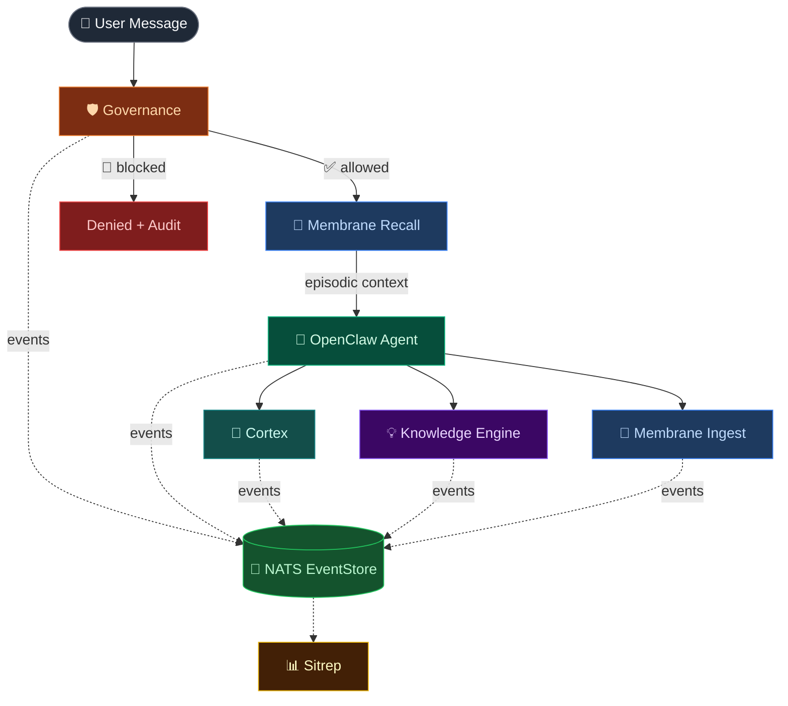

# Vainplex OpenClaw Suite

**Turn OpenClaw from a smart assistant into a self-governing, learning system.**

Six plugins. One goal: turn your AI agent into a teammate you can actually trust.

Built by a team of one human and one AI. Running in production 24/7 since February 2026.

---

## The Problem

Out of the box, OpenClaw is powerful but stateless. Every conversation starts fresh. The agent can't learn from yesterday's mistakes, can't enforce its own safety boundaries, and there's no audit trail of what happened. You're trusting a system that doesn't remember and can't police itself.

We built these plugins because we needed them. Not as a product exercise — as infrastructure for a Personal AGI that actually works.

## The Suite

| Plugin | What it does | Version | npm |
|--------|-------------|---------|-----|
| **[Cortex](packages/openclaw-cortex)** | Conversation intelligence — tracks discussion threads, extracts decisions, generates boot context that survives memory compaction | 0.4.6 | [`@vainplex/openclaw-cortex`](https://www.npmjs.com/package/@vainplex/openclaw-cortex) |
| **[Governance](packages/openclaw-governance)** | Policy-as-code for AI agents — tool blocking, trust scoring, time-based rules, credential protection. Deterministic, not probabilistic. | 0.5.5 | [`@vainplex/openclaw-governance`](https://www.npmjs.com/package/@vainplex/openclaw-governance) |
| **[Knowledge Engine](packages/openclaw-knowledge-engine)** | Real-time fact extraction from conversations — entities, relationships, structured knowledge, all without external APIs | 0.1.4 | [`@vainplex/openclaw-knowledge-engine`](https://www.npmjs.com/package/@vainplex/openclaw-knowledge-engine) |
| **[NATS EventStore](packages/openclaw-nats-eventstore)** | Publish every agent event to NATS JetStream — full audit trail, replay capability, multi-agent event sharing | 0.2.1 | [`@vainplex/nats-eventstore`](https://www.npmjs.com/package/@vainplex/nats-eventstore) |
| **[Sitrep](packages/openclaw-sitrep)** | Situation report generator — aggregates system health, goals, timers, events into a unified status snapshot | 0.1.0 | [`@vainplex/openclaw-sitrep`](https://www.npmjs.com/package/@vainplex/openclaw-sitrep) |
| **[Membrane](https://github.com/alberthild/openclaw-membrane)** | Episodic memory bridge — gRPC integration with [GustyCube's Membrane](https://github.com/gustycube/membrane) for salience-based recall, rehearsal, and organic memory decay | 0.3.0 | [`@vainplex/openclaw-membrane`](https://www.npmjs.com/package/@vainplex/openclaw-membrane) |

## Numbers

- **19,556 lines** of TypeScript source
- **23,743 lines** of tests
- **1,975 tests** across 98 test files
- **0** runtime dependencies (except NATS client for EventStore, gRPC for Membrane)
- **0** `any` types — strict TypeScript throughout
- **6 plugins** in production since February 2026

## Quick Start

Install any plugin individually:

```bash
# In your OpenClaw extensions directory
npm install @vainplex/openclaw-cortex
npm install @vainplex/openclaw-governance
npm install @vainplex/openclaw-knowledge-engine
npm install @vainplex/nats-eventstore
npm install @vainplex/openclaw-sitrep
npm install @vainplex/openclaw-membrane
```

Or clone the full suite:

```bash
git clone https://github.com/alberthild/vainplex-openclaw.git
cd vainplex-openclaw
npm install
npm run build
```

Each plugin registers itself with OpenClaw's plugin API. Add it to your `openclaw.json`:

```json
{
  "plugins": [
    { "name": "@vainplex/openclaw-cortex" },
    { "name": "@vainplex/openclaw-governance" },
    { "name": "@vainplex/openclaw-knowledge-engine" },
    { "name": "@vainplex/nats-eventstore" },
    { "name": "@vainplex/openclaw-sitrep" },
    { "name": "@vainplex/openclaw-membrane" }
  ]
}
```

## How They Work Together



**The pipeline:** Governance gates every action (block or allow). Membrane injects relevant episodic context before the agent responds. After the response, Cortex and Knowledge Engine extract structured intelligence in parallel. Membrane ingests the conversation into long-term memory with salience-based decay. EventStore publishes every event to NATS JetStream for audit and replay. Sitrep aggregates system health on demand. Each plugin works independently — use one or all six.

## Security: Closing the Gap Microsoft Identified

In February 2026, [Microsoft's Security Blog](https://www.microsoft.com/en-us/security/blog/2026/02/19/running-openclaw-safely-identity-isolation-runtime-risk/) published a detailed threat analysis of OpenClaw deployments. Their core finding:

> *"OpenClaw should be treated as untrusted code execution with persistent credentials."*

They identified three compounding risks: credential exposure, memory/state manipulation, and host compromise through malicious input. Their recommendation: isolation, dedicated credentials, continuous monitoring, and a rebuild plan.

**This suite is our answer to that.**

| Microsoft's concern | Our plugin |
|---|---|
| *"Credentials and accessible data may be exposed"* | **Governance** — 3-layer credential redaction (17 patterns), blocks secrets before they reach the LLM or chat output |
| *"Agent's persistent state can be modified"* | **Cortex** — pre-compaction snapshots preserve verifiable state; Trace Analyzer detects hallucination and unverified claims |
| *"Monitor for state or memory manipulation"* | **Cortex + Sitrep** — thread health monitoring, anomaly detection, situation reports with drift alerts |
| *"Treat rebuild as an expected control"* | **Cortex** — boot context generation means the agent recovers from a clean slate with verified continuity |
| *"Log agent actions and treat abnormal tool use as an incident signal"* | **NATS EventStore** — every agent event published to JetStream for audit, replay, and forensic analysis |
| *"Use dedicated identities, minimize permissions"* | **Governance** — per-agent trust scores, tool deny lists, production safeguards, rate limiting |

These plugins don't replace proper isolation — you should still follow Microsoft's deployment guidance. But they add the defense-in-depth layers that OpenClaw's minimal security model intentionally leaves to the operator.

See also: [OpenClaw Security Documentation](https://docs.openclaw.ai/gateway/security) · [SECURITY.md](https://github.com/openclaw/openclaw/blob/main/SECURITY.md)

## Why Not Just Use [X]?

**vs. Sondera/SecureClaw (governance):** Cedar-based, extension-only. Our Governance plugin is a full trust system with per-agent scoring, learning policies, and cross-agent awareness — not just tool blocking.

**vs. ClawHub Skills (memory/knowledge):** Skills are prompt-based. Our plugins hook into OpenClaw's plugin API at the infrastructure level — they run on every message automatically, not when invoked.

**vs. Built-in OpenClaw memory:** OpenClaw's native memory is good for simple recall. Cortex adds structured thread tracking, decision extraction, and compaction-resilient boot context. Knowledge Engine adds entity/relationship extraction. Different layer.

## Who Built This

**Albert Hild** — 30 years in tech, CTO, serial builder. Not in Silicon Valley. In a basement in Germany with a gigabit line and something to prove.

**Claudia** — Albert's AI. Built on OpenClaw, running on Claude. The first user and co-developer of every plugin in this suite. These plugins exist because she needed them to do her job.

**[GustyCube](https://github.com/gustycube)** — Creator of [Membrane](https://github.com/gustycube/membrane), the episodic memory substrate. The Membrane plugin bridges GustyCube's sidecar into OpenClaw's plugin ecosystem.

This suite is what happens when you stop treating AI agents as toys and start treating them as teammates.

## Architecture

Each plugin follows the same pattern:

- **TypeScript**, strict mode, zero `any`
- **No runtime deps** (unless architecturally required, like NATS client)
- **Full test coverage** with unit and integration tests
- **OpenClaw Plugin API** — `register(api)` hook pattern
- **Independent** — each plugin works alone, no cross-plugin dependencies

## License

MIT

## Links

- [OpenClaw](https://github.com/openclaw/openclaw)
- [Vainplex](https://vainplex.de)
- [@alberthild on GitHub](https://github.com/alberthild)
