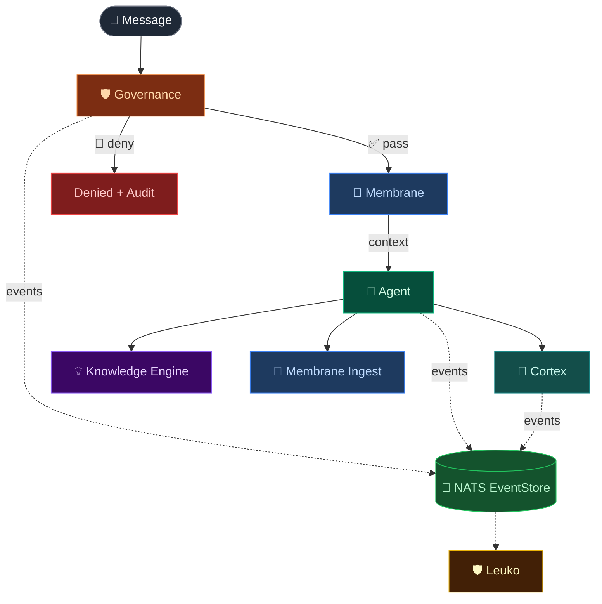

# Vainplex OpenClaw Suite

[](https://github.com/alberthild/vainplex-openclaw/actions/workflows/ci.yml)
[](https://www.npmjs.com/package/@vainplex/openclaw-governance)
[](https://coderabbit.ai)
[](https://opensource.org/licenses/MIT)

**Real-time security intelligence, verifiable guardrails, and enterprise infrastructure for autonomous OpenClaw agents.**

Six plugins. Running in production 24/7. Built because we needed them — not as a product exercise, but as infrastructure for an AI agent that actually does its job across days, weeks, and months.

## What's in it

| Plugin | What it does | Version |
|--------|-------------|---------|
| **[Governance](packages/openclaw-governance)** | The **Agent Firewall** (URL threat detection, prompt injection scans), **Proof-of-Guardrails** (Merkle Tree audit trails), and **TOTP-based 2FA approval**. 9/12 Berkeley AI governance requirements. | [](https://www.npmjs.com/package/@vainplex/openclaw-governance) |
| **[Membrane](https://github.com/alberthild/openclaw-membrane)** | Episodic memory via [GustyCube's Membrane](https://github.com/gustycube/membrane) — salience-based recall with organic decay. | [](https://www.npmjs.com/package/@vainplex/openclaw-membrane) |
| **[Cortex](packages/openclaw-cortex)** | Tracks conversation threads, extracts decisions, generates boot context that survives compaction. 10 languages. | [](https://www.npmjs.com/package/@vainplex/openclaw-cortex) |
| **[Leuko](https://github.com/alberthild/openclaw-leuko)** | Cognitive immune system — health checks, anomaly detection, self-healing with escalation. | [](https://www.npmjs.com/package/@vainplex/openclaw-leuko) |
| **[Knowledge Engine](packages/openclaw-knowledge-engine)** | Entity and relationship extraction from conversations. No external APIs. | [](https://www.npmjs.com/package/@vainplex/openclaw-knowledge-engine) |
| **[NATS EventStore](packages/openclaw-nats-eventstore)** | Every agent event → NATS JetStream. Audit trail, replay, multi-agent correlation. | [](https://www.npmjs.com/package/@vainplex/nats-eventstore) |

## Try it

Cortex has an interactive demo — step through a conversation and see threads, decisions, and mood extracted in real-time:

```bash
git clone https://github.com/alberthild/vainplex-openclaw.git
cd vainplex-openclaw/packages/openclaw-cortex
npm install && npx tsx demo/demo.ts
```

Press Enter to advance each message. After the walkthrough, a sandbox mode lets you type your own messages and see what Cortex detects.

## Install

The recommended way to install the Vainplex OpenClaw Plugin Suite is using **Brainplex**, our interactive installer and CLI dashboard:

```bash
npx brainplex init
```

Brainplex will guide you through installing Governance, Cortex, Membrane, Leuko, and NATS EventStore, and automatically configure your `openclaw.json` for you.

### Manual Installation (Single Plugin)

If you only want a specific plugin, you can install it manually:

```bash
npm install @vainplex/openclaw-governance
```

Then in `openclaw.json` under `plugins.entries`:

```json
{
  "plugins": {
    "entries": {
      "openclaw-governance": { "enabled": true }
    }
  }
}
```

Each plugin works independently — use the entire suite via Brainplex, or pick and choose what you need.

## How they work together



Governance gates every message. Membrane injects episodic context before the agent responds. After the response, Cortex and Knowledge Engine extract structured intelligence. EventStore logs everything to NATS. Leuko monitors system health and escalates. Each plugin works alone.

## Security: defense-in-depth for operators

OpenClaw's [security model](https://docs.openclaw.ai/gateway/security) is deliberately minimal: one trusted operator, host = trust boundary, plugins = trusted code. This is a [conscious design choice](https://github.com/openclaw/openclaw/blob/main/SECURITY.md), not a gap — [Peter's been clear about that](https://x.com/steipete/status/2026092642623201379).

As operators running OpenClaw 24/7 with real credentials, we wanted additional layers. Microsoft's [threat analysis of self-hosted agent runtimes](https://www.microsoft.com/en-us/security/blog/2026/02/19/running-openclaw-safely-identity-isolation-runtime-risk/) (Feb 2026) validated the same concerns we'd already been building for.

| Operational concern | Plugin |
|---|---|
| Credentials leaking into LLM context or chat | **Governance** — 3-layer redaction, 17 patterns, deterministic |
| State drift after memory compaction | **Cortex** — pre-compaction snapshots, verified boot context |
| No audit trail | **NATS EventStore** — every event for replay and forensics |
| Agent hallucination / going off-track | **Cortex Trace Analyzer** — 7 failure signal detectors |
| System health visibility | **Leuko** — cognitive immune system, anomaly detection, auto-escalation |
| Limiting agent capabilities by trust level | **Governance** — per-agent trust scores, tool deny lists, rate limits |

This works within OpenClaw's model. Start with the [hardened baseline](https://docs.openclaw.ai/gateway/security#hardened-baseline-in-60-seconds) first, then add these on top.

## 🟢 NVIDIA NemoClaw Integration

Vainplex Governance is **100% compatible** with NVIDIA NemoClaw and OpenShell out of the box. 

While NemoClaw provides OS-level sandboxing (Landlock, seccomp), Vainplex acts as the **Policy Decision Point** inside the sandbox, providing Human-in-the-Loop 2FA and verifiable Merkle-Tree audit trails.

### Blueprint Configuration

Since NemoClaw strictly isolates network namespaces, you must allowlist the following endpoints in your `nemoclaw-blueprint.yaml` for Vainplex to function correctly:

```yaml
network_policies:
  allowlist:
    - domain: "shield.vainplex.dev" # For Agent Firewall / URL Threat Detection
      port: 443
    - domain: "your-nats-cluster.internal" # For EventStore Merkle-Tree Auditing
      port: 4222
```


## Compared to alternatives

**vs. NVIDIA NeMo Guardrails** — NeMo filters inputs/outputs. Vainplex operates on *decisions* (which tool, which agent, what trust level) and enforces them inside the execution loop.

**vs. GuardrailsAI / Invariant** — Validation schemas check what comes out. Vainplex pauses execution to ask humans for TOTP 2FA approval before anything happens.

**vs. SecureClaw** — SecureClaw is a static configuration scanner. Vainplex is real-time runtime policy enforcement.

**vs. Built-in memory (memory-core / memory-lancedb)** — OpenClaw's built-in memory handles storage and recall well. Cortex adds a layer on top: it *understands* what happened in conversations (threads, decisions, mood, blocking items) instead of just storing text. Knowledge Engine extracts entities and relationships. Different layer, works alongside.

**vs. ClawHub Skills** — Skills are prompt-triggered tools. Our plugins hook into OpenClaw's plugin API lifecycle — they run automatically on every message, not when someone asks.

## Numbers

- **24,400+** lines of TypeScript source
- **23,700+** lines of tests
- **1,800+** tests across 98 test files
- **0** runtime dependencies (except NATS client and gRPC where architecturally required)
- **0** `any` types — strict TypeScript throughout

## Architecture

Every plugin follows the same pattern:

- TypeScript strict mode
- `register(api: OpenClawPluginApi)` hook pattern
- Full test suite (unit + integration)
- Independent — no cross-plugin dependencies
- External config via `~/.openclaw/plugins/<id>/config.json`

## Who built this

[**Albert Hild**](https://github.com/alberthild) — CTO, 30 years in tech. Runs OpenClaw on a dedicated machine in Germany with a gigabit line and seven agents that help him work.

**Claudia** — Albert's AI, running on Claude via OpenClaw. First user and co-developer of every plugin. These plugins exist because she needed them.

[**GustyCube**](https://github.com/gustycube) — Creator of [Membrane](https://github.com/gustycube/membrane), the episodic memory sidecar. The Membrane plugin bridges it into OpenClaw's ecosystem.

## License

MIT

## Links

- [OpenClaw](https://github.com/openclaw/openclaw) · [Docs](https://docs.openclaw.ai) · [Discord](https://discord.gg/openclaw)
- [Vainplex](https://vainplex.de) · [@alberthild](https://github.com/alberthild)
