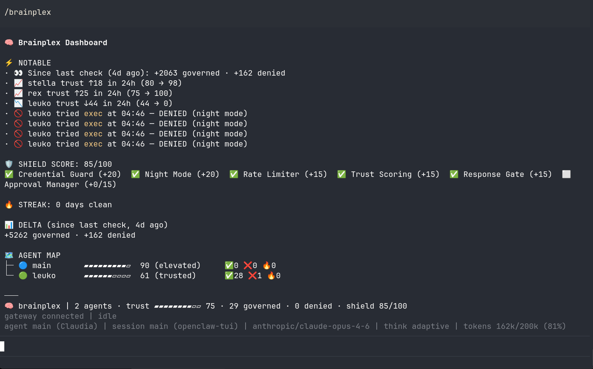

# 🧠 Brainplex

**The intelligence layer for AI agents.**

[](https://www.npmjs.com/package/brainplex)
[](https://www.npmjs.com/package/brainplex)
[](https://opensource.org/licenses/MIT)

```bash
npx brainplex init
```

One command. 60 seconds. Your agents get trust scoring, runtime policies, persistent memory, self-learning from mistakes, and health monitoring.

## Before and After

**Before Brainplex:**
- Your agent has full permissions — day and night, in production and dev
- Every session starts from zero — no memory of yesterday
- You find out something broke when a user complains
- Sub-agents inherit all parent permissions without boundaries

**After Brainplex:**
- Every agent has a trust score. Permissions scale with behavior. Night mode blocks risky ops at 3am.
- Agents remember conversations, decisions, and commitments across sessions
- Anomaly detection catches problems before users do
- Cross-agent trust ceilings prevent permission escalation

**Real example:** You install Brainplex, go to sleep. Next morning:

```
⚡ NOTABLE (while you were away)
· 🚫 forge tried exec("rm -rf /tmp/cache") at 03:22 — DENIED (night mode)
· 🔒 2 API keys redacted from agent output (credential guard)
· main made 47 governed calls between 00:00–06:00 — all clean
```

## Install

```bash
npx brainplex init
```

Brainplex detects your agents, installs the modules, generates configs, and wires everything in:

```
🧠 Brainplex — The Intelligence Layer for AI Agents

🔍 Scanning...
   ✓ Found 3 agents: main, forge, cerberus

📦 Installing...
   ✓ Governance · Cortex · Membrane · Leuko

⚙️  Configuring...
   ✓ Trust: main=60, forge=45, cerberus=50, *=10
   ✓ Night mode: 23:00–06:00
   ✓ Credential guard: ON

✓ Done — run: openclaw gateway restart
```

| Flag | Effect |
|------|--------|
| `--full` | Include Knowledge Engine (entity extraction, fact store) |
| `--dry-run` | Preview without making changes |
| `--config <path>` | Custom openclaw.json path |
| `--verbose` | Show npm install output |

## Dashboard

After installing, type `/brainplex` in any agent conversation:



Trust scores, governance stats, notable events, shield score — one command.

## The Five Modules

### 🔒 Governance — The Firewall

Controls what agents can do and when.

- **Trust scoring** — per-agent scores that rise with clean behavior, drop with violations
- **Policy engine** — YAML-based rules with conditions (time, tool, context, trust level)
- **Night mode** — block destructive commands outside business hours
- **Credential guard** — 3-layer detection (regex → entropy → hash vault), redaction before output
- **Approval workflows** — require human sign-off for sensitive operations
- **Audit trail** — append-only JSONL with ISO 27001 controls
- **Cross-agent governance** — parent policies propagate to sub-agents, trust ceilings prevent escalation

### 🧠 Cortex — The Brain

Learns from what your agents do.

- **Thread tracking** — auto-detect open work items from conversations
- **Decision tracking** — extract and persist decisions with impact classification
- **Commitment tracking** — detect promises, track fulfillment, flag overdue items
- **Trace analysis** — 3-stage pipeline: detect → classify (LLM) → generate rules
- **7 signal detectors** — corrections, doom loops, hallucinations, repeat failures, dissatisfaction, unverified claims, tool failures
- **Auto-generated rules** — findings become SOUL.md rules, governance policies, or cortex patterns
- **10-language support** — pattern detection in EN, DE, FR, ES, PT, IT, JA, KO, RU, ZH

### 💾 Membrane — The Memory

Gives agents persistent context across sessions.

- **Episodic memory** — what happened in past conversations
- **Semantic memory** — facts and relationships extracted from interactions
- **Working memory** — current task context and state
- **Agent isolation** — each agent's memories are separated, no cross-contamination
- **Salience filtering** — retrieves only what's relevant to the current conversation

### ⚕️ Leuko — The Immune System

Monitors agent health and catches problems early.

- **Anomaly detection** — directory growth spikes, declining metrics, trend analysis
- **Bootstrap integrity** — checks that critical config files haven't drifted
- **Pipeline correlation** — detects when failures in one system affect another
- **LLM-powered recommendations** — actionable suggestions based on current system state
- **Goal quality checks** — flags stale or poorly defined goals

### 📚 Knowledge Engine — The Knowledge Base *(optional)*

Structured knowledge extraction and retrieval.

- **Entity extraction** — regex + LLM-powered extraction of people, orgs, products, dates
- **Fact store** — SPO triples (Subject-Predicate-Object) with relevance decay
- **Vector embeddings** — ChromaDB sync for semantic search
- **Deduplication** — automatic merging of duplicate entities and facts

Install with `--full` flag.

## How They Work Together

```
Message in → Governance (policy + trust gate)
          → Membrane (inject relevant memories)
          → Agent processes
          → Governance (response gate + credential redaction + audit)
          → Cortex (track threads, decisions; analyze traces)
          → Leuko (health monitoring)
          → Knowledge Engine (extract entities, store facts)
```

Each module works independently — install just one if that's all you need. But together, they compound: Cortex learns from Governance denials. Leuko monitors Membrane health. Knowledge Engine enriches Cortex's context.

## Design

- **Zero telemetry** — no tracking, no analytics, no phone-home
- **Zero dependencies** — Node.js builtins only
- **Never overwrites** existing configs (backs up first)
- **Never auto-restarts** your gateway
- **Idempotent** — run it twice, nothing breaks
- **MIT licensed** — fork it, modify it, sell it

## Requirements

- Node.js ≥ 22
- OpenClaw with `openclaw.json`

## Individual Modules

Don't want the full suite? Each module is independently installable:

```bash
npm install @vainplex/openclaw-governance    # Policy engine, trust, approval, redaction
npm install @vainplex/openclaw-cortex        # Conversation intelligence, trace analysis
npm install @vainplex/openclaw-membrane      # Episodic memory
npm install @vainplex/openclaw-leuko         # Health monitoring
npm install @vainplex/openclaw-knowledge-engine  # Entity extraction, fact store
```

## Contributing

[github.com/alberthild/vainplex-openclaw](https://github.com/alberthild/vainplex-openclaw)

## License

MIT © [Albert Hild](https://github.com/alberthild)
