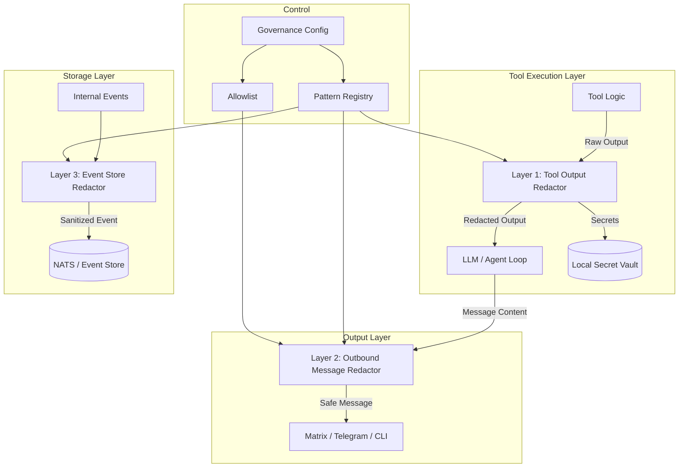

# RFC-007: Deterministic Redaction Layer

| Status | Proposed → Under Review |
| :--- | :--- |
| **Author** | Atlas (OpenClaw) |
| **Reviewer** | Claudia |
| **Date** | 2026-02-20 |
| **Package** | `@vainplex/openclaw-governance` |
| **Priority** | Critical (Security Fix) |

## 1. Architecture Overview

The Redaction Layer provides a deterministic, high-performance defense-in-depth system to prevent the leakage of sensitive information (credentials, PII, financial data) from OpenClaw to external users or logs. It operates as a three-layer filter integrated into the existing Governance plugin.

### Diagram



## 2. The Three Layers

### Layer 1: Tool Output Redaction (Ingress)
- **Purpose**: Prevent the LLM from ever seeing raw secrets returned by tools.
- **Hook**: `after_tool_call` — intercept `event.result` before it reaches the LLM.
- **Mechanism**: Recursively scan the `result` object (strings and nested objects) for patterns.
- **Replacement**: Replaces sensitive data with a placeholder: `[REDACTED:<type>:<hash8>]`.
- **Value**: If the LLM "echoes" a redacted string, it echoes the placeholder, not the secret.
- **MUST**: Scan both string values AND string values inside JSON strings (recursive JSON parse).

### Layer 2: Outbound Message Redaction (Egress)
- **Purpose**: Prevent accidental leaks if a secret bypasses Layer 1 or is hardcoded in the agent's logic.
- **Hook**: `message_sending` (existing) and `before_message_write` (existing).
- **Mechanism**: Final safety scan of all outbound text.
- **Scope**: Includes GDPR data (Emails, Phone numbers) which MAY be permissible for the LLM to see (Layer 1) but MUST NOT be exported.
- **MUST**: Support per-channel allowlists (e.g., PII allowed on internal Matrix, blocked on external channels).

### Layer 3: Event Store Redaction (Persistence)
- **Purpose**: Ensure that even if a leak occurs in memory, it is never persisted to disk or the NATS bus.
- **Hook**: `before_event_persist` (requires OpenClaw core to expose this hook — **external dependency**).
- **Scope**: Sanitizes `AuditRecord` and internal event logs.
- **FALLBACK**: If `before_event_persist` hook is not available in the current OpenClaw version, apply redaction in the `after_tool_call` handler before the event is written to the audit trail. This covers Governance's own audit records but NOT OpenClaw's native event persistence.

## 3. Pattern Registry Design

A unified registry of regular expressions categorized by type.

### 3.1 Built-in Patterns

| Category | Pattern | Description |
| :--- | :--- | :--- |
| **credential** | `sk-[a-zA-Z0-9]{20,}` | OpenAI API keys |
| **credential** | `sk-ant-[a-zA-Z0-9-]{80,}` | Anthropic API keys |
| **credential** | `AIza[0-9A-Za-z_-]{35}` | Google API keys |
| **credential** | `ghp_[a-zA-Z0-9]{36}` | GitHub personal access tokens |
| **credential** | `ghs_[a-zA-Z0-9]{36}` | GitHub server tokens |
| **credential** | `glpat-[a-zA-Z0-9_-]{20,}` | GitLab personal access tokens |
| **credential** | `-----BEGIN (RSA |EC |OPENSSH )?PRIVATE KEY-----` | Private key headers |
| **credential** | `Bearer [a-zA-Z0-9_.-]{20,}` | Bearer tokens (in context) |
| **credential** | `(?:password|passwd|pwd|secret|token|api_key|apikey)\s*[:=]\s*['"]?[^\s'"]{8,}` | Key=value credential patterns |
| **pii** | `[a-zA-Z0-9._%+-]+@[a-zA-Z0-9.-]+\.[a-zA-Z]{2,}` | Email addresses |
| **pii** | `\+?[1-9]\d{6,14}` | Phone numbers (E.164-ish) |
| **financial** | `\b[45]\d{3}[\s-]?\d{4}[\s-]?\d{4}[\s-]?\d{4}\b` | Credit card numbers |
| **financial** | `\b[A-Z]{2}\d{2}\s?[A-Z0-9]{4}\s?(\d{4}\s?){2,7}\d{1,4}\b` | IBAN numbers |

### 3.2 Pattern Priority & Conflict Resolution

- Patterns are evaluated in category order: `credential` → `financial` → `pii` → `custom`.
- If multiple patterns match the same text range, the **most specific** (longest match) wins.
- Custom patterns MUST NOT override built-in credential patterns (security invariant).

### 3.3 Implementation

```typescript
interface RedactionPattern {
  id: string;
  category: 'credential' | 'pii' | 'financial' | 'custom';
  regex: RegExp;
  replacementType: string;
  /** Built-in patterns cannot be disabled via config */
  builtin: boolean;
}
```

### 3.4 Performance Requirements

- **MUST** process 100KB input in < 5ms (deterministic regex, no backtracking)
- **MUST** use non-greedy quantifiers and atomic grouping where possible
- **MUST** pre-compile all regex at startup (not per-call)
- All patterns MUST be tested against ReDoS attacks (catastrophic backtracking)

## 4. Local Vault Design

The Vault stores the mapping between placeholders and real values.

### 4.1 Core Design

- **Storage**: In-memory `Map<string, string>` per session.
- **Placeholder format**: `[REDACTED:<category>:<hash8>]` where `hash8` is first 8 chars of SHA-256 of the original value.
- **Reverse lookup**: `Map<hash8, originalValue>` for placeholder resolution in `before_tool_call`.

### 4.2 Security Invariants

- **MUST** use a cryptographic hash (SHA-256), not djb2 or similar — prevents brute-force recovery from placeholder.
- **MUST** clear vault on session end AND after configurable inactivity timeout (default: 1 hour).
- **MUST NOT** persist vault to disk or send vault contents over the network.
- **MUST NOT** allow vault contents to appear in audit logs or error messages.
- **MUST** handle hash collisions: if two different secrets produce the same hash8, use hash12 for the second one.

### 4.3 Placeholder Resolution Rules

When the `before_tool_call` hook detects a `[REDACTED:...]` placeholder in tool params:
1. Resolve the placeholder to the original value from the vault.
2. **Log an audit entry** that a secret was resolved (but NOT the secret value).
3. If the placeholder cannot be resolved (expired, unknown), **block the tool call** with a clear error.

### 4.4 Edge Case: Credential Rotation

If a secret value changes between vault storage and resolution (e.g., API key rotated), the vault still holds the OLD value. This is acceptable because:
- Vault TTL is 1 hour (short-lived)
- If the old credential no longer works, the tool call will fail naturally
- The agent can request fresh credentials via a new tool call

## 5. Hook Integration Plan

### 5.1 Hook: `after_tool_call` (Layer 1)
1. Intercept `event.result`.
2. Deep-scan for patterns (strings, nested objects, JSON-within-strings).
3. For each match: generate hash, store original in vault, replace with placeholder.
4. Mutate `event.result` in-place with placeholders.
5. **MUST** handle circular references in result objects.
6. **MUST** skip redaction for whitelisted tools (configurable, e.g., `["session_status"]`).

### 5.2 Hook: `before_tool_call` (Vault Resolution)
1. Deep-scan `event.params` for `[REDACTED:...]` patterns.
2. Resolve each placeholder via vault lookup.
3. If resolution fails: block the tool call with `blockReason: "Unresolvable redacted credential"`.
4. **Inject** real values back into params.
5. **MUST NOT** log the resolved values.

### 5.3 Hook: `message_sending` (Layer 2)
1. Final pass on `event.content`.
2. Scan for credential and PII patterns.
3. For credentials: **always** redact (no exceptions).
4. For PII: check channel allowlist — internal channels MAY pass PII, external channels MUST NOT.
5. If redaction occurs, modify `event.content` in-place.
6. **MUST** also scan `event.metadata` if present.

### 5.4 Hook: `before_message_write` (Layer 2, synchronous)
1. Same as message_sending but synchronous.
2. Only credential + financial patterns (PII may be needed in conversation context).

## 6. Allowlist System

### 6.1 Channel Allowlists

```typescript
interface RedactionAllowlist {
  /** Channels where PII is allowed to pass through (e.g., internal Matrix) */
  piiAllowedChannels: string[];
  /** Channels where financial data is allowed (e.g., internal admin tools) */
  financialAllowedChannels: string[];
  /** Tools whose output should not be redacted (e.g., status commands) */
  exemptTools: string[];
  /** Agent IDs that are exempt from outbound redaction (e.g., admin agents) */
  exemptAgents: string[];
}
```

### 6.2 Allowlist Rules

- Credentials are **NEVER** allowlisted — no exception, no override.
- PII allowlists only apply to Layer 2 (outbound). Layer 1 still redacts.
- `exemptTools` only applies to Layer 1 (tool output). Layer 2 still scans.
- Allowlists are audited: every allowlist bypass is logged.

## 7. File List & Estimates

| File | Description | Estimated LOC |
| :--- | :--- | :--- |
| `src/redaction/registry.ts` | Built-in + custom pattern management, ReDoS-safe compilation | 150 |
| `src/redaction/engine.ts` | Recursive scanning, replacement, JSON-within-string handling | 250 |
| `src/redaction/vault.ts` | SHA-256 hash, TTL, collision handling, resolution | 120 |
| `src/redaction/hooks.ts` | All 4 hook handlers, allowlist checks, audit logging | 180 |
| `src/redaction/allowlist.ts` | Channel/tool/agent allowlist evaluation | 60 |
| `src/types.ts` | Updated configuration and redaction types | 60 |
| `test/redaction/registry.test.ts` | Pattern matching, priority, ReDoS safety | 150 |
| `test/redaction/engine.test.ts` | Recursive scan, JSON-in-string, circular refs, 100KB perf | 200 |
| `test/redaction/vault.test.ts` | Hash, TTL, collision, resolution, expired entries | 120 |
| `test/redaction/hooks.test.ts` | End-to-end hook integration, allowlist bypass audit | 150 |
| `test/redaction/allowlist.test.ts` | Channel/tool/agent exemption logic | 80 |
| **Total** | | **~1,520 LOC** |

## 8. Test Strategy

### 8.1 Unit Tests
- Test each built-in pattern against known secret formats (min 5 positive + 5 negative per pattern).
- Test pattern priority: overlapping matches resolve to longest/most-specific.
- Test ReDoS: each regex tested with adversarial input (e.g., `"a" * 100000`), MUST complete in < 10ms.
- Test vault hash collision handling.
- Test vault TTL expiry.

### 8.2 Integration Tests
- Mock a tool returning `PASSWORD=MyS3cretP4ss!`. Verify LLM receives `[REDACTED:credential:a1b2c3d4]`.
- Mock an agent sending `albert@vainplex.de` to Matrix (internal). Verify: **allowed** (internal allowlist).
- Mock an agent sending `albert@vainplex.de` to Twitter. Verify: **redacted**.
- Mock a tool call using `[REDACTED:credential:a1b2c3d4]` as a param. Verify: tool receives `MyS3cretP4ss!`.
- Mock a tool call with expired placeholder. Verify: **blocked**.
- Test circular reference object → no infinite loop.

### 8.3 Performance Benchmark
- 100KB random text with 10 embedded secrets → processed in < 5ms.
- 1MB tool output → processed in < 50ms.
- Vault with 1000 entries → resolution in < 1ms.

### 8.4 Security Tests
- Verify credentials CANNOT be allowlisted (attempt to add to exemptTools → still redacted).
- Verify vault contents never appear in audit logs.
- Verify placeholder hash cannot be reversed to original value.

## 9. Config Schema

```json
{
  "governance": {
    "redaction": {
      "enabled": true,
      "categories": ["credential", "pii", "financial"],
      "vaultExpirySeconds": 3600,
      "failMode": "closed",
      "customPatterns": [
        {
          "name": "NATS_URL",
          "regex": "nats://[^\\s]+",
          "category": "credential"
        }
      ],
      "allowlist": {
        "piiAllowedChannels": ["matrix"],
        "financialAllowedChannels": [],
        "exemptTools": ["session_status", "governance"],
        "exemptAgents": []
      },
      "performanceBudgetMs": 5
    }
  }
}
```

## 10. Dependency on OpenClaw Core

### 10.1 Required Hooks

| Hook | Status | Notes |
| :--- | :--- | :--- |
| `after_tool_call` | ✅ Available | Used for Layer 1 (result mutation) |
| `before_tool_call` | ✅ Available | Used for vault resolution |
| `message_sending` | ✅ Available | Used for Layer 2 (outbound) |
| `before_message_write` | ✅ Available | Used for Layer 2 (synchronous) |
| `before_event_persist` | ❌ Not available | Needed for Layer 3 |

### 10.2 Layer 3 Strategy

Since `before_event_persist` is not available in current OpenClaw:
1. **Immediate**: Apply redaction in `after_tool_call` BEFORE the result reaches the audit trail. This covers Governance's own records.
2. **PR to OpenClaw**: Propose `before_event_persist` hook to OpenClaw core for full Layer 3 coverage.
3. **Workaround**: The existing `audit-redactor.ts` already redacts sensitive keys in audit records — extend it with the full pattern registry.

## 11. Open Questions (Resolved in Review)

1. **Q: Should Layer 1 redact ALL email addresses from tool output?**
   A: Yes. The LLM doesn't need to see raw email addresses to compose a reply. It can work with `[REDACTED:pii:...]` and the vault resolves it when needed.

2. **Q: What about base64-encoded secrets?**
   A: Phase 2. Detecting base64-wrapped secrets requires decoding and re-scanning, which impacts performance. For v0.5.0, we detect only plaintext patterns.

3. **Q: Should we support `[REDACTED:...]` in system prompts?**
   A: No. System prompts are set by the operator and should contain only the values the operator intends. Redacting system prompts would break functionality.

---
*End of RFC-007 Architecture Document — Reviewed 2026-02-20*
